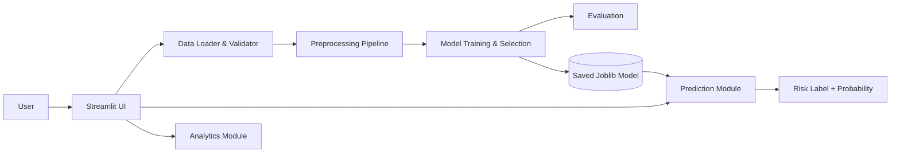
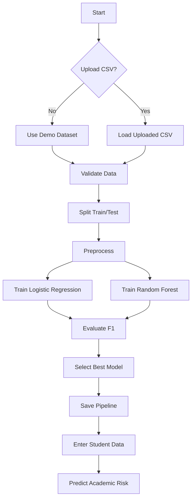
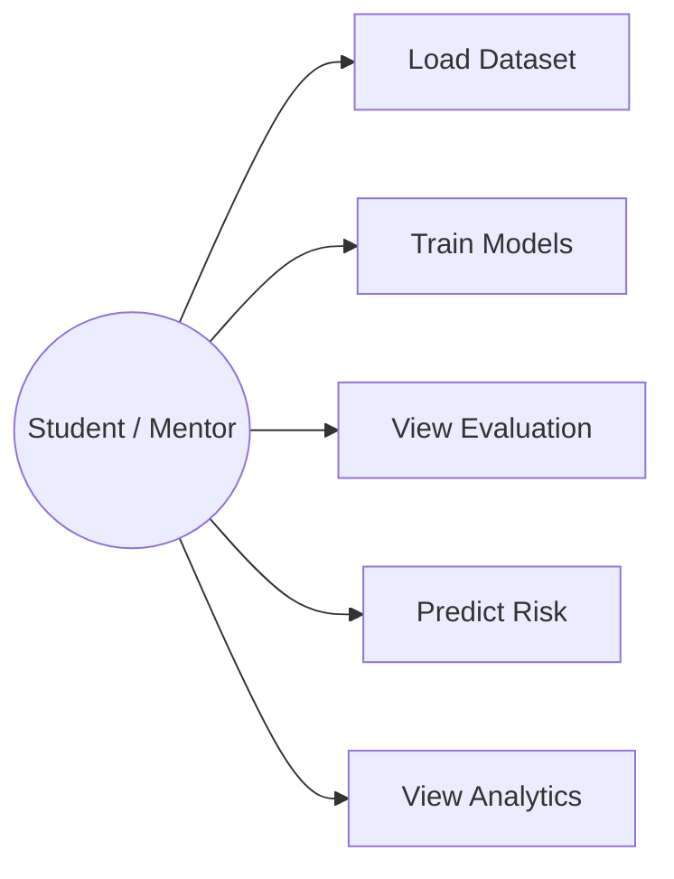
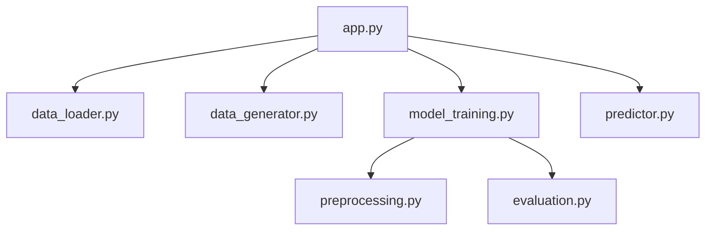
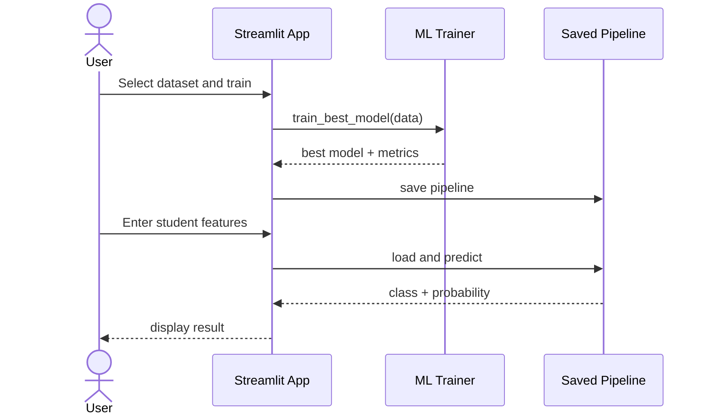

# Architecture and Diagrams

## System Architecture

```mermaid
flowchart LR
    U[User] --> UI[Streamlit UI]
    UI --> D[Data Loader & Validator]
    D --> P[Preprocessing Pipeline]
    P --> M[Model Training & Selection]
    M --> E[Evaluation]
    M --> S[(Saved Joblib Model)]
    UI --> R[Prediction Module]
    S --> R
    R --> O[Risk Label + Probability]
    UI --> A[Analytics Module]
```

## Workflow

```mermaid
flowchart TD
    A[Start] --> B{Upload CSV?}
    B -- No --> C[Use Demo Dataset]
    B -- Yes --> D[Load Uploaded CSV]
    C --> E[Validate Data]
    D --> E
    E --> F[Split Train/Test]
    F --> G[Preprocess]
    G --> H[Train Logistic Regression]
    G --> I[Train Random Forest]
    H --> J[Evaluate F1]
    I --> J
    J --> K[Select Best Model]
    K --> L[Save Pipeline]
    L --> M[Enter Student Data]
    M --> N[Predict Academic Risk]
```

## Use Case Diagram

```mermaid
flowchart LR
    User((Student / Mentor))
    User --> UC1[Load Dataset]
    User --> UC2[Train Models]
    User --> UC3[View Evaluation]
    User --> UC4[Predict Risk]
    User --> UC5[View Analytics]
```

## Component Diagram

```mermaid
flowchart TB
    APP[app.py]
    DL[data_loader.py]
    DG[data_generator.py]
    PP[preprocessing.py]
    MT[model_training.py]
    EV[evaluation.py]
    PR[predictor.py]
    APP --> DL
    APP --> DG
    APP --> MT
    APP --> PR
    MT --> PP
    MT --> EV
```

## Sequence Diagram

```mermaid
sequenceDiagram
    actor User
    participant UI as Streamlit App
    participant Trainer as ML Trainer
    participant Model as Saved Pipeline

    User->>UI: Select dataset and train
    UI->>Trainer: train_best_model(data)
    Trainer-->>UI: best model + metrics
    UI->>Model: save pipeline
    User->>UI: Enter student features
    UI->>Model: load and predict
    Model-->>UI: class + probability
    UI-->>User: display result
```
